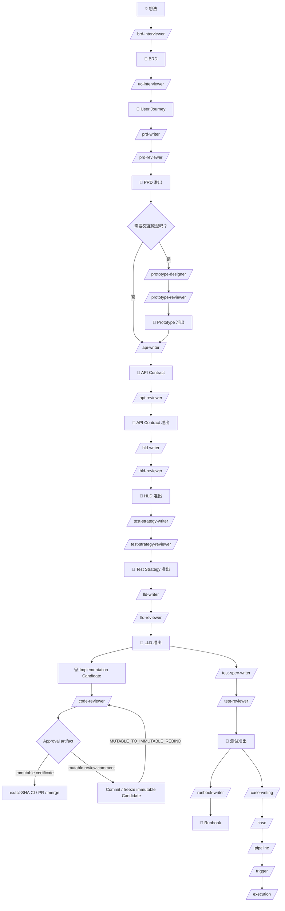
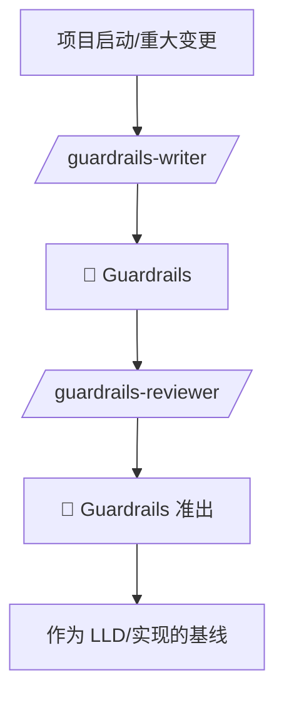
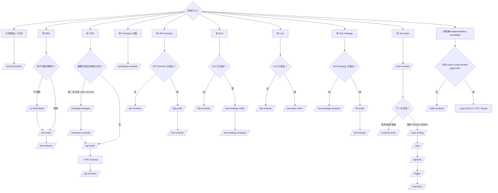

# testany-eng

研发流程工具集：从业务需求、设计到源码评审、测试设计与运维准备的完整链路。

## 概述

testany-eng 提供一套结构化的研发工作流工具，覆盖从业务想法到源码评审、测试设计与交付准备的全流程：

- **需求阶段**：BRD 访谈 → 用户旅程对齐 → PRD 撰写/审查
- **交互验证阶段（前端仓库可选）**：Prototype 设计/评审
- **设计阶段**：API 契约撰写/审查 → HLD 撰写/审查 → 测试策略撰写/评审 → LLD 撰写/审查
- **实现评审阶段**：精确 Implementation Candidate → Scope Lock → Code Review → exact-SHA CI/PR/merge（分别授权）
- **测试与交付准备阶段**：测试规格/测试包撰写 → 测试门禁评审 → Runbook 撰写 / Testany 自动化落地

每个环节都有明确的输入输出和质量门禁，确保文档质量和上下游衔接。对于已经准出的 Test Spec，`testany-eng` 也应把用户自然推到 `testany-bot` 的自动化落地链路，而不是停在文档侧。

默认情况下，`testany-eng` 会跟随用户输入语言输出；用户显式指定语言时以用户指定为准；`TRACEABILITY-METADATA` 的字段名、枚举值与稳定 ID 始终保持英文。

## 追溯元数据约定

testany-eng 提供统一的 traceability metadata contract，用于 RTM 生成、覆盖率校验和文档间自动追溯。

- canonical 设计稿：`references/traceability-schema/traceability-schema-v1.md`
- PRD profile v1 示例：`references/traceability-schema/prd-profile-v1.example.yaml`
- HLD profile v1 示例：`references/traceability-schema/hld-profile-v1.example.yaml`
- LLD profile v1 示例：`references/traceability-schema/lld-profile-v1.example.yaml`
- Test Strategy profile v1 示例：`references/traceability-schema/test-strategy-profile-v1.example.yaml`
- Test Spec profile v1 示例：`references/traceability-schema/test-spec-profile-v1.example.yaml`
- trace-lint 契约：`references/traceability-schema/trace-lint-contract-v1.md`
- trace-build-rtm 契约：`references/traceability-schema/trace-build-rtm-contract-v1.md`

当前 rollout 状态是：**PRD / HLD / LLD / Test Strategy / Test Spec 五层已接入；RTM 已支持 PRD（REQ-*）→ HLD（DEC-*/FLOW-*）→ LLD（DEC-*/FLOW-*）→ Test Strategy（RISK-*/MR-*/BEH-*）→ Test Spec（CASE-*）链路聚合。**

最直接的校验命令：

```bash
python3 plugins/testany-eng/scripts/trace_lint.py <PRD.md 或 metadata.yaml>
python3 plugins/testany-eng/scripts/trace_lint.py --strict <PRD.md 或 metadata.yaml>
python3 plugins/testany-eng/scripts/trace_lint.py --format json <PRD.md 或 metadata.yaml>
python3 plugins/testany-eng/scripts/trace_lint.py plugins/testany-eng/references/traceability-schema/hld-profile-v1.example.yaml
python3 plugins/testany-eng/scripts/trace_lint.py plugins/testany-eng/references/traceability-schema/lld-profile-v1.example.yaml
python3 plugins/testany-eng/scripts/trace_lint.py plugins/testany-eng/references/traceability-schema/test-strategy-profile-v1.example.yaml
python3 plugins/testany-eng/scripts/trace_lint.py plugins/testany-eng/references/traceability-schema/test-spec-profile-v1.example.yaml
python3 plugins/testany-eng/scripts/trace_build_rtm.py <多个 metadata 文档>
python3 plugins/testany-eng/scripts/trace_build_rtm.py --format json <多个 metadata 文档>
python3 plugins/testany-eng/scripts/trace_build_rtm.py --format json <PRD.md> <HLD.md> <LLD.md> <Test-Strategy.md> <Test-Spec.md>
```

---

## 工作流程

以下 DAG 是正式新功能流程。已有系统的有限修复先按实际决策层级分流，不从缺失的历史文档倒推一整轮重写。

### 有限变更与评审边界

`guide`、`hld-reviewer`、`lld-reviewer`、`code-reviewer` 共用 [review-boundaries.md](references/review-boundaries.md)。这是一份评审者行为规则，不是新增产品发布平台。

| 实际对象 | 入口 | 边界 |
|---|---|---|
| 已批准职责内的 SQL、事务、重试、配置修复方案 | LLD `bounded_change` | 可用现有一页修复计划，不强制全套 Manifest/测试/Runbook |
| 职责、信任、运行依赖或失败语义变化 | HLD `bounded_change` | 只审架构增量，设计授权独立确认 |
| wire/身份/权限契约增量 | API Review | HLD/LLD/Code comment 不代替契约批准 |
| 精确实现 Candidate | Code Review | 保留既有 Scope Lock、证据、delta 与有限漏审状态机 |

混合请求按问题拆开；仓库数量、安全关键词和“技术方案”标题不决定层级。新增授权边界要回到原始 Owner 决定，不能用 Reviewer comment → 作者 APPROVED note → 新评审的循环自证。已授权工程细节可直接判断，产品行为/权限对象/收费/支持范围变化才交产品 Owner；外部写入、发布策略、部署仍需各自明确许可。

HLD/LLD 正式模式保留完整覆盖；有限模式只给对应增量意见。P2 数量不阻断这两类设计评审及 Code Review，必要 gap 关闭即停止。其他 skill 的准出规则本轮未重写。

### 正式新功能流程



---

## 项目级规范维护流程（Guardrails）

> Guardrails 是项目级基线，不随每个功能重复创建，仅在以下情况触发：新项目/架构变更/合规要求/事故复盘。



---

## 我应该用哪个 Skill？

如果你不确定当前项目已经走到哪一步，或者接手的是一个已有部分文档的存量仓库，先运行 `/guide`。它会扫描现有文档、识别准出状态，并推荐下一步最合适的 skill；当 Test Spec 已具备下游 handoff 时，也会把你路由到 `testany-bot` 的自动化落地分支。

### 快速选择表

| 你的情况 | 使用命令 | 说明 |
|----------|----------|------|
| 不确定项目当前在哪一步，或接手了一个已有部分文档的项目 | `/guide` | 扫描现有文档与准出状态，推荐下一步最合适的 skill |
| 有个模糊的想法，想梳理成业务需求 | `/brd-interviewer` | 通过选择题访谈，输出 BRD |
| BRD 写完了，要细化用户操作流程 | `/uc-interviewer` | 逐条对齐 user journey |
| 要写产品需求文档 | `/prd-writer` | 基于 BRD + Journey 撰写 PRD |
| PRD 写完了，需要独立评审 | `/prd-reviewer` | 多角色视角审查 |
| 有 PRD + User Journey，要在前端仓库先验证交互 | `/prototype-designer` | 生成隔离原型，提前暴露交互、状态和导航问题 |
| Prototype 做完了，需要作为 API/HLD 前的门禁 | `/prototype-reviewer` | 审查上游对齐、工程隔离和下游输入质量 |
| PRD 准出了，要定义 API 契约 | `/api-writer` | 输出 OpenAPI/gRPC/Event 等契约 |
| API 契约写完了，需要评审 | `/api-reviewer` | 检查契约完整性与一致性 |
| 需要制定项目级工程规范 | `/guardrails-writer` | 建立全局 Guardrails（不随功能重复） |
| Guardrails 写完了，需要评审 | `/guardrails-reviewer` | 检查触发判定、事实标准、workflow hooks 与规则可执行性 |
| 有 PRD + API Contract，要写技术方案 | `/hld-writer` | 基于 PRD + 契约撰写 HLD |
| HLD 写完了，需要技术评审 | `/hld-reviewer` | 检测 PRD→HLD 漂移 |
| 存量修复拟改变职责、信任、依赖或失败边界 | `/hld-reviewer` | 只评估架构增量，不自动授予变更权限 |
| HLD 准出了，要定义测试方法和门禁 | `/test-strategy-writer` | 基于 PRD/API/HLD 定义测试策略 |
| 测试策略写完了，需要评审 | `/test-strategy-reviewer` | 审查风险覆盖、分层与环境策略 |
| HLD 准出了，要写详细设计 | `/lld-writer` | 将 HLD 细化为可实现的设计 |
| LLD 写完了，需要设计评审 | `/lld-reviewer` | 检测 HLD→LLD 一致性 |
| 存量修复只涉及既有职责内的方法、SQL、事务、重试 | `/lld-reviewer` | 有限工程设计评审；跨仓不自动升级 HLD |
| 已有精确实现 Candidate，需要 Lead Dev 源码评审 | `/code-reviewer` | 冻结 Scope Lock 后检查实现正确性；不扩大需求/架构，不替代部署批准 |
| LLD 准出了，要写完整测试包 | `/test-spec-writer` | 产出 test case package、追溯矩阵与执行说明 |
| 测试包写完了，需要测试门禁评审 | `/test-reviewer` | 审查覆盖、证据与残余风险 |
| 测试门禁通过后，要准备运维手册 | `/runbook-writer` | 基于 HLD/LLD/Test 输出生产就绪 Runbook |
| Test Spec / 测试准出已具备，想落到 Testany 自动化 | `/case-writing` | 从 approved Test Spec + `Testany Automation Handoff` 生成 Testany-compatible cases |
| 已生成 Testany case packages，要注册到平台 | `/case` | 把 package 注册成平台 case |
| 已有 registered cases，要组装执行链路 | `/pipeline` | 按 decomposition / relay / branch 组装 pipeline |
| 已有 pipeline，要立即执行或配置入口 | `/trigger` | 发起一次执行，或配置 Plan / Gatekeeper |
| 执行已经发起，要看进度或查失败 | `/execution` | 查看 execution 状态、历史与失败交接 |

> 说明：`/case-writing`、`/case`、`/pipeline`、`/trigger`、`/execution` 来自同仓库下的 `testany-bot` 插件，是 Test Spec 准出后的自动化落地分支。

### 决策树

先应用上面的有限变更入口；下图用于正式产物链与实现 Candidate，不表示所有修复都必须补齐它。



---

## Skills 详情

### brd-interviewer

**用途**：将模糊的业务想法转化为结构化的 BRD（业务需求文档）

**特点**：
- 麦肯锡/BCG 顾问式访谈
- 只问选择题，降低用户认知负担
- 强制量化成功指标
- 守住 BRD 边界，不越界到技术方案

**输入**：一句话想法
**输出**：BRD 文档

**示例**：
```
/brd-interviewer 我想提高用户留存率
```

---

### uc-interviewer

**用途**：在 BRD 和 PRD 之间建立对齐检查点，确保用户旅程符合预期

**特点**：
- 先确认最新批准 BRD baseline，再逐条 Journey 确认
- 两段式访谈：开放发现 → 结构化确认
- 逐条 Journey 确认（主流程 → 跳转/分支 → 异常 → 步骤级 edge case matrix）
- 每个 Journey 确认后再进入下一个
- 输出带 `TRACEABILITY-METADATA` 的 USER_JOURNEY 基线，可直接喂给 prd-writer

**输入**：BRD 文件路径
**输出**：User Journey 文档（含 checkpoint 状态与 traceability metadata）

**示例**：
```
/uc-interviewer ./docs/BRD-用户认证.md
```

---

### prd-writer

**用途**：撰写高质量的产品需求文档

**特点**：
- 先读后写，遵循项目现有约定
- 支持 BRD 1:N 拆分为多个 PRD
- 自动识别并复用现有能力
- 守住 PRD 边界，不越界到 HLD

**输入**：BRD 路径 + User Journey 路径（可选）
**输出**：PRD 文档

**示例**：
```
/prd-writer ./docs/BRD-订单系统.md ./docs/User-Journeys.md
```

---

### prd-reviewer

**用途**：独立第三方视角审查 PRD，作为"准出门禁"

**特点**：
- 多角色视角：PM、开发、测试、业务方
- 问题分级：P0 阻塞 / P1 严重 / P2 建议
- 迭代审查直到放行
- 输出审查报告 + 准出证书

**输入**：PRD 文件路径
**输出**：审查报告 + 准出证书（通过时）

**示例**：
```
/prd-reviewer ./docs/PRD-用户认证.md
```

---

### prototype-designer

**用途**：在前端仓库中生成可交互的 UI 原型，在进入 API Contract / HLD 之前验证交互模式和流转逻辑

**特点**：
- 原型服务于验证，不是生产代码
- 默认沙箱隔离，避免污染生产目录
- 优先复用仓库现有组件、路由和样式体系
- 用 mock 数据提前暴露页面状态和数据需求
- 页面可追溯到 User Journey 节点和 PRD 需求

**输入**：PRD 路径 + User Journey 路径
**输出**：原型沙箱目录 + Prototype Manifest + 交付摘要

**示例**：
```
/prototype-designer ./docs/PRD-用户认证.md ./docs/User-Journeys-用户认证.md
```

---

### prototype-reviewer

**用途**：作为 Prototype 进入 API Contract / HLD 前的独立门禁，审查上游对齐、交互完整性、工程隔离和下游输入质量

**特点**：
- 四道门审查：上游对齐 → 原型完整性 → 工程隔离 → 下游可用性
- 强调沙箱目录、路由前缀、零依赖新增、零生产文件改动
- 同时检查 Prototype 对 API Contract 和 HLD 的输入是否清晰
- 严格准出：P0=0, P1=0, P2≤2

**输入**：原型沙箱目录路径 + PRD 路径 + User Journey 路径
**输出**：审查报告 + 准出证书（通过时）

**示例**：
```
/prototype-reviewer ./src/prototype ./docs/PRD-用户认证.md ./docs/User-Journeys-用户认证.md
```

---

### api-writer

**用途**：基于 PRD 产出可审查的 API 契约/协议文档

**特点**：
- 支持 9 种协议：HTTP/GraphQL/gRPC/Event/WebSocket/Webhook/SDK/File/IPC
- 多协议时自动生成 Contract Index
- PRD → Contract 100% 覆盖检查
- 只写接口，不写实现

**输入**：PRD 文件路径
**输出**：API Contract 文档

**示例**：
```
/api-writer ./docs/PRD-订单系统.md
```

---

### api-reviewer

**用途**：评审 API 契约/接口协议文档，作为进入 HLD/LLD/实现前的门禁

**特点**：
- 四道门禁：基线与覆盖 → 协议完整性 → 漂移/冲突 → 兼容性/演进
- 强制 PRD → Contract 100% 覆盖
- 多协议强制 Contract Index
- 严格准出：P0=0, P1=0, P2≤2

**输入**：API Contract 路径 + PRD 路径（可选：Index 路径）
**输出**：审查报告 + 准出证书（通过时）

**示例**：
```
/api-reviewer ./docs/API-Contract-订单系统.md ./docs/PRD-订单系统.md
```

---

### guardrails-writer

**用途**：创建或更新项目级 Guardrails 基线，用于约束主流程而不是替代主流程

**特点**：
- 先判定是否真的需要更新，再决定改哪些领域
- 首次生成支持访谈式与仓库分析式两种模式
- 风险优先，覆盖安全/API/数据/发布/可观测性
- Must/Should/Nice 分级、例外流程、下游重审钩子

**输入**：项目/规范路径 + 变更背景（如有）
**输出**：Guardrails 文档 + 下游工作流钩子摘要

**示例**：
```
/guardrails-writer ./docs/project-context
```

---

### guardrails-reviewer

**用途**：评审 Guardrails 作为项目级治理基线是否可准出

**特点**：
- 五道门：触发判定 → 事实标准 → 规则质量 → workflow hooks → 可落地性
- 严格准出：P0=0, P1=0, P2≤2

**输入**：Guardrails 路径
**输出**：审查报告 + 准出证书（通过时）

**示例**：
```
/guardrails-reviewer ./docs/Guardrails.md
```

---

### hld-writer

**用途**：将 PRD 需求转化为高层技术设计文档

**特点**：
- 聚焦高成本决策：技术选型、架构模式
- 强制 PRD 需求映射
- 基于 API Contract 作为接口唯一事实源
- 复用 vs 新建决策
- 不写实现代码

**输入**：PRD 路径 + API Contract 路径
**输出**：HLD 文档

**示例**：
```
/hld-writer ./docs/PRD-用户认证.md ./docs/API-Contract-用户认证.md
```

---

### hld-reviewer

**用途**：模拟真实 Design Review 会议，检测 PRD→HLD 漂移

**特点**：
- 三道门禁：PRD 覆盖 → 技术决策 → 风险评估
- 漂移检测：遗漏、膨胀、变形、降级
- 多角色视角：架构师、安全、SRE、业务方
- 输出覆盖表 + 漂移报告
- 支持正式设计和有限架构增量；核实原始授权，技术必要性不豁免边界
- 技术结论与 scope_status 分列，P2 永不阻断；有待决定/缺证时不签准出证书

**输入**：正式 HLD + PRD/Contract，或有限架构变更说明 + 相关批准基线
**输出**：正式设计报告/证书，或仅对应有限增量的评审意见；不授予部署权限

**示例**：
```
/hld-reviewer ./docs/HLD-用户认证.md ./docs/PRD-用户认证.md
```

---

### test-strategy-writer

**用途**：基于 PRD、API Contract、HLD 产出测试策略，明确怎么测

**特点**：
- 风险驱动：先识别关键业务/数据/兼容/稳定性风险
- 分层明确：System Integration / E2E / Regression / Compatibility / Non-functional 分工清晰
- 强制环境/数据/依赖策略
- 明确开发内建验证属于上游前置条件
- 只写独立测试方法，不写详细 case

**输入**：PRD 路径 + API Contract 路径 + HLD 路径 + Guardrails 路径（如有）
**输出**：Test Strategy 文档

**示例**：
```
/test-strategy-writer ./docs/PRD-用户认证.md ./docs/API-Contract-用户认证.md ./docs/HLD-用户认证.md ./docs/Guardrails.md
```

---

### test-strategy-reviewer

**用途**：评审测试策略，确认风险覆盖、独立测试分层与门禁标准是否成立

**特点**：
- 四道门禁：基线与范围 → 风险覆盖与分层 → 环境/数据/依赖 → 门禁与自动化
- 严格准出：P0=0, P1=0, P2≤2
- 可作为 `test-spec-writer` 的正式基线

**输入**：Test Strategy 路径 + PRD 路径 + API Contract 路径 + HLD 路径
**输出**：审查报告 + 准出证书（通过时）

**示例**：
```
/test-strategy-reviewer ./docs/Test-Strategy-用户认证.md ./docs/PRD-用户认证.md ./docs/API-Contract-用户认证.md ./docs/HLD-用户认证.md
```

---

### lld-writer

**用途**：将 HLD 架构决策细化为可实现的低层设计文档

**特点**：
- 模块化组合：Core + Add-ons + Profile + Guardrails
- 基于 API Contract 作为接口唯一事实源
- 输出 LLD Manifest 记录模块选择与理由
- 包含伪代码、流程图、测试设计
- 不写完整实现代码

**输入**：PRD 路径 + HLD 路径 + API Contract 路径 + Guardrails 路径（如有）
**输出**：LLD 文档 + LLD Manifest + 追溯映射表

**示例**：
```
/lld-writer ./docs/PRD-用户认证.md ./docs/HLD-用户认证.md ./docs/API-Contract-用户认证.md ./docs/Guardrails.md
```

---

### lld-reviewer

**用途**：评审正式 LLD 或已有批准边界内的有限工程修复，检测 HLD→LLD 漂移与实现风险

**特点**：
- 四道门禁：基线与 Manifest → 一致性与漂移 → 模块完整性 → 可实现性与风险
- 正式模式执行四道门；有限模式按受影响链路检查，不因缺全套 Manifest 强制重做文档
- P0/P1 和必要证据/授权缺口关闭即停止，P2 不阻断
- 按实际项目级规则影响触发 Guardrails，不为每个局部修复新增治理门禁
- Contract 是事实源，不得重写

**输入**：正式 LLD 及上游基线，或有限修复说明及相关批准依据
**输出**：正式设计报告/证书，或仅对应有限增量的评审意见；技术结论与授权分列

**示例**：
```
/lld-reviewer ./docs/LLD-用户认证.md ./docs/PRD-用户认证.md ./docs/HLD-用户认证.md ./docs/API-Contract-用户认证.md ./docs/Guardrails.md
```

---

### code-reviewer

**用途**：对精确 Implementation Candidate 做独立 Lead Dev Code Review，验证源码是否正确实现已批准范围

**特点**：
- 评审前冻结 base/Candidate/tree、批准基线、In/Out Scope 与 architecture budget
- 新增/争议基线追溯原始有权决定；自己的旧 comment 不经授权不能变成架构预算
- 首轮检查完整 Candidate diff；同一 Scope Lock 下，旧完整覆盖可信、两类 gap 为空且旧内容/直接影响范围可重建时，整改轮只检查 delta、原 blocking closure 和直接回归面
- Candidate 自行加入且可删除/回退的 budget 外 surface 返回 `CHANGES_REQUIRED`；只有边界含糊或最小正确修复确需扩 scope 时才返回 `SCOPE_DECISION_REQUIRED`
- P0/P1 必须有 frozen invariant、精确证据、复现路径、影响，以及不超出已批准 architecture budget 的最小修复
- 核对实际生产入口/provider/parser、真实 helper 与独立 oracle；成对检查合法接受和非法拒绝，沿直接 caller/branch/target 与跨尝试恢复状态判断整改闭合
- 核查管理 API/compiler 能否表达拟议配置；直接向执行器喂自写转换结果不证明生产管理链可用
- 同 finding ID 仍披露原问题未修完、新回归、旧原因漏报的因果与 reviewer 责任；漏审后的独立复核必须改变失效的验证方法
- P2 永不阻断或捆绑当轮整改；最小修复同时约束架构面与新增操作/门禁维护负担，源码、CI、环境结论分离
- 使用一份可核验 Review Record，报告/子任务引用，不重复抄历史；只有内容、依赖、命令、工具、配置和基线核验一致才能复用 source/local 证据，新 Candidate 仍需新绑定与 verdict
- Skill 自身有缩小的生产语义正反样本与盲测控制，分别评估漏报、误报、越界和收敛；不把样本通过冒充真实部署通过

**输入**：仓库路径 + base/previous Candidate + Candidate + 已批准基线；有上一轮 terminal 时还必须提供其可读取的精确 artifact（`path@version + SHA-256` 或 canonical embedded envelope），不能只给 findings 摘要
**输出**：Review Comment 或 Code Review Approval Certificate + 一份共享 Review Record（可内嵌，不强制新增文件；不授予部署权限）

**示例**：
```
/code-reviewer . main abc123 ./docs/LLD-用户认证.md
```

---

### test-spec-writer

**用途**：基于批准的 Test Strategy 与 LLD，产出完整的测试规格与 test case package

**特点**：
- 输出完整 package，而非零散 case
- 强制追溯：需求/接口/设计/风险 → 测试项
- 细化主流程、分支、异常、边界、系统集成、回归与非功能验证
- 输出覆盖率摘要：需求/风险/外部行为/场景/NFR 分项统计
- 包含环境、数据、依赖与证据要求
- 不展开开发内建测试层的详细 case

**输入**：PRD 路径 + API Contract 路径 + HLD 路径 + LLD 路径 + Test Strategy 路径
**输出**：Test Spec / Test Case Package

**示例**：
```
/test-spec-writer ./docs/PRD-用户认证.md ./docs/API-Contract-用户认证.md ./docs/HLD-用户认证.md ./docs/LLD-用户认证.md ./docs/Test-Strategy-用户认证.md
```

---

### test-reviewer

**用途**：评审测试包，检查覆盖、追溯、执行证据与残余风险，作为发布准备前的测试门禁

**特点**：
- 四道门禁：基线与追溯 → 覆盖与漂移 → 可执行性 → 执行证据与残余风险
- 支持设计准备评审与发布前测试门禁两种模式
- 使用统一的测试设计覆盖率口径做门禁判断
- 严格准出：P0=0, P1=0, P2≤2

**输入**：Test Spec 路径 + Test Strategy 路径 + 执行摘要/缺陷清单（发布前模式建议提供）
**输出**：审查报告 + 准出证书（通过时）

**示例**：
```
/test-reviewer ./docs/Test-Spec-用户认证.md ./docs/Test-Strategy-用户认证.md ./docs/test-execution-summary.md
```

---

### runbook-writer

**用途**：基于 HLD、LLD、测试约束与交付方式，编写生产就绪的 Runbook

**特点**：
- 覆盖部署、回滚、监控、故障处理与值班手册
- 双阶段审查：Spec compliance → Quality review
- Context 隔离：Writer/Reviewer 使用隔离上下文

**输入**：HLD 路径 + LLD 路径 + API Contract 路径 + Guardrails 路径（如有）
**输出**：Runbook 文档

**示例**：
```
/runbook-writer ./docs/HLD-用户认证.md ./docs/LLD-用户认证.md ./docs/API-Contract-用户认证.md ./docs/Guardrails.md
```

---

## 文档流转关系

下表是正式产物流转；有限变更复用现有说明和相关批准依据，按前述分流执行，不要求补齐整表。

| 上游文档 | Skill | 下游文档 |
|----------|-------|----------|
| 想法 | brd-interviewer | BRD |
| BRD | uc-interviewer | User Journey |
| BRD + Journey | prd-writer | PRD |
| PRD | prd-reviewer | PRD（准出） |
| PRD + User Journey | prototype-designer | Prototype 沙箱 + Manifest + 交付摘要 |
| Prototype 沙箱 + PRD + User Journey | prototype-reviewer | Prototype（准出） |
| PRD | api-writer | API Contract |
| PRD + API Contract | api-reviewer | API Contract（准出） |
| PRD + API Contract | hld-writer | HLD |
| HLD + PRD | hld-reviewer | HLD（准出） |
| PRD + API Contract + HLD + Guardrails（如有） | test-strategy-writer | Test Strategy |
| Test Strategy + PRD + API Contract + HLD | test-strategy-reviewer | Test Strategy（准出） |
| 项目启动/变更 | guardrails-writer | Guardrails |
| Guardrails | guardrails-reviewer | Guardrails（准出） |
| PRD + HLD + Contract + Guardrails（如有） | lld-writer | LLD + Manifest |
| LLD + PRD + HLD + Contract + Guardrails（如有） | lld-reviewer | LLD（准出） |
| Exact base/Candidate + approved baselines + Scope Lock | code-reviewer | Implementation Candidate（源码准出） |
| PRD + API Contract + HLD + LLD + Test Strategy | test-spec-writer | Test Spec / Test Case Package |
| Test Spec + Test Strategy + 执行摘要（可选） | test-reviewer | 测试准出 |
| HLD + LLD + API Contract + Guardrails（如有） | runbook-writer | Runbook |
| Approved Test Spec + Testany Automation Handoff | case-writing | Testany platform case packages + decomposition |
| Testany platform case packages | case | Registered Testany cases |
| Registered Testany cases + decomposition | pipeline | Testany pipeline |
| Testany pipeline | trigger | Trigger / ad-hoc execution |
| Triggered pipeline execution | execution | Execution 观测与管理 |

---

## 安装

```bash
claude plugins add testany-eng
```

或手动克隆到 `~/.claude/plugins/` 目录。

---

## 贡献

欢迎提交 Issue 和 PR 到 [testany-agent-skills](https://github.com/TestAny-io/testany-agent-skills) 仓库。
