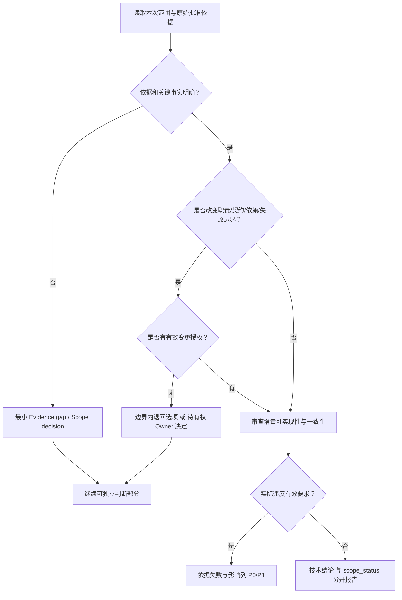

# HLD→LLD 漂移检测指南

本文档定义了 HLD→LLD 漂移的类型、判定标准和检测方法。

先遵守 `../../../references/review-boundaries.md`。正式设计检查完整上游映射；有限修复仅检查受影响的有效基线、ADR/用户决定与原行为。表中的类型描述不是自动严重度：必要事实未知记 Evidence gap，真实边界变化记 Scope decision，已证明违反有效要求才按影响定 P0/P1。技术必要性标注不是授权豁免。

## 漂移的危害

在多 AI Agent 协同工作流中，HLD→LLD 漂移会导致：
- 实现偏离架构设计
- 技术债务累积
- 系统质量下降
- 维护成本增加

## 漂移类型定义

### 1. 遗漏（Omission）

**定义**：HLD 有明确设计，但 LLD 中没有对应实现设计。

**处理**：已证明关键行为无法实现时按影响定 P0/P1；仅缺设计细节则请求最小证据。有限 delta 未重述无关模块不算遗漏。

**判定标准**：
- HLD 中的架构决策在 LLD 中完全没有体现
- HLD 中的模块/组件在 LLD 中没有对应设计
- HLD 中的接口在 LLD 中没有实现设计

**检测方法**：
1. 提取 HLD 中所有架构决策点
2. 逐条检查 LLD 是否有对应设计
3. 使用追溯映射表验证覆盖率

**示例**：

| HLD 设计 | LLD 覆盖 | 判定 |
|----------|----------|------|
| 「采用 Redis 缓存热点数据」 | LLD 无缓存设计 | ❌ 遗漏 |
| 「实现熔断机制」 | LLD 无熔断设计 | ❌ 遗漏 |

---

### 2. 膨胀（Inflation）

**定义**：LLD 中有设计内容，但 HLD 中没有对应的架构决策。

**处理**：优先要求退回已批准边界内的最小实现；确需改变边界时单列 Scope decision，而不是让作者补一段“技术必要性”即可准出。

**判定标准**：
- LLD 引入了 HLD 未定义的新模块
- LLD 引入了 HLD 未定义的新组件
- LLD 引入了 HLD 未定义的新接口
- 即使没有新组件，也改变机器/人的授权职责、常态外部依赖、权限管理来源或依赖失败时的业务行为

**技术理由与授权分开核对**：

| 理由 | 必须查明的事实 | 不能据此自动授权的变化 |
|------|----------------|------------------------|
| 实现依赖 | 哪条有效 invariant 失败；现有能力是否足够 | 因需验签而新建常设密钥服务 |
| 安全/合规 | 哪个已适用要求、具体威胁与最小防护 | 泛称更安全，给机器任务增加用户 PDP |
| 稳定性 | 真实失败模式、已有恢复能力与成本 | 因遇到重试错误就新增 DLQ/ledger/回放平台 |
| 行业惯例 | 是否只是授权工程预算内的实现选择 | 以最佳实践替代架构或产品批准 |

必要性可简述如下，不要求新增审批文档：
```
有效依据：[原始批准记录/相关条目]
失败与最小方案：[具体失败、边界内替代方案、取舍]
新增边界及负担：[没有 / 具体变化]
批准来源：[已有授权及范围 / 待有权 Owner 裁定]
```

**检测方法**：
1. 提取 LLD 中所有设计决策
2. 检查是否能在 HLD 中找到对应来源
3. 若无来源，区分细节实现与真正边界变化；核对原始授权，不把 Reviewer 旧意见及其派生 APPROVED note 当批准
4. 技术理由充分但授权未闭合时，可给技术结论，同时明确 `scope_status: DECISION_REQUIRED`，不能签准出证书

---

### 3. 变形（Distortion）

**定义**：LLD 对 HLD 的理解偏离原意。

**处理**：明确违反有效意图按影响分级；方案请求改变意图且授权未定则列 Scope decision。

**判定标准**：
- LLD 的实现方式与 HLD 的设计意图不符
- LLD 改变了 HLD 定义的数据流
- LLD 改变了 HLD 定义的控制流
- LLD 改变了 HLD 定义的组件职责

**检测方法**：
1. 理解 HLD 设计的意图和上下文
2. 对比 LLD 实现是否符合意图
3. 核对是否存在真实有效的增量批准；理由合理或补写偏离说明不代表获批

**示例**：

| HLD 设计 | LLD 实现 | 判定 |
|----------|----------|------|
| 「用户服务负责认证」 | 「认证逻辑放在网关」 | 职责边界变化；核对有权工程 Owner 批准，不能仅补理由 |
| 「同步调用下游服务」 | 「改为异步消息」 | 核对控制流/失败语义变化；需要相应授权而非 reviewer 自批 |

---

### 4. 降级（Degradation）

**定义**：HLD 定义的质量要求在 LLD 中被放宽。

**处理**：按已批准要求与实际影响分级；有效需求/指标尚未确认则列证据缺口。

**判定标准**：
- HLD 定义的性能指标在 LLD 中被降低
- HLD 定义的可靠性要求在 LLD 中被放宽
- HLD 定义的安全要求在 LLD 中被简化
- HLD 定义的可观测性要求在 LLD 中被削减

**检测方法**：
1. 提取 HLD 中的质量要求（性能/可靠性/安全/可观测性）
2. 对比 LLD 中的对应设计
3. 检查是否有质量下降

**示例**：

| HLD 要求 | LLD 设计 | 判定 |
|----------|----------|------|
| 「P99 响应时间 < 100ms」 | 无性能设计 | ❌ 降级 |
| 「99.9% 可用性」 | 无高可用设计 | ❌ 降级 |
| 「敏感数据加密存储」 | 明文存储 | ❌ 降级 |

---

### 5. Contract 冲突（Contract Conflict）

**定义**：LLD 与 API Contract 不一致。

**处理**：明确冲突按实际影响分级；尚待裁定的契约增量不能当作已生效事实，也不自动判为 P0。

**判定标准**：
- 接口签名不一致（方法名、参数、返回值）
- 错误码不一致
- 权限定义不一致
- 请求/响应结构不一致

**检测方法**：
1. 逐个对比 LLD 接口设计与 Contract 定义
2. 检查字段名、类型、必填性
3. 检查错误码定义

**Contract 是事实源原则**：
- LLD 不得重写或改动 Contract
- 发现不一致时，LLD 必须修改以符合 Contract
- 若需修改 Contract，只评审受影响增量并由相应权限 Owner 决定，LLD comment 不替代契约批准

---

## 漂移检测流程



---

## 漂移报告格式

```markdown
## 漂移检测报告

### 统计
| 类型 | 数量 | 判定 |
|------|------|------|
| 已证实漂移 | {n} | {P0/P1 及实际影响} |
| 关键事实未证实 | {n} | Evidence gap |
| 新增/冲突边界 | {n} | Scope decision |
| 可选建议 | {n} | P2，不阻断 |

### 问题清单

| 稳定 ID | 类型 | 有效依据/原始批准 | 方案位置 | 失败及影响 | 最小修复/待决事项 | 边界变化 |
|---------|------|------------------|----------|------------|------------------|----------|
| {ID} | {类型} | {位置及批准范围} | {位置} | {事实} | {边界内修复或有权 Owner 选项} | {无/具体变化} |
```

---

## 最佳实践

### 预防漂移

1. **LLD 作者**：
   - 严格按照 HLD 设计编写 LLD
   - 实现细节说明依据与取舍，不增加不必要文档
   - 真正偏离 HLD 时明确旧/新边界、影响与批准来源；待批方案不得标成已批准

2. **LLD Reviewer**：
   - 使用追溯映射表验证覆盖率
   - 逐条检查 HLD→LLD 一致性
   - 对新增边界分别核查技术理由和授权来源，不让“更安全”变成通行证

### 处理漂移

1. **遗漏**：在本次受影响范围内补足必要设计或证据，不重写无关模块
2. **膨胀**：优先删除未经授权的额外设计、回到明确基线；确需变更则由有权 Owner 决定
3. **变形**：恢复批准语义，或在独立增量中请求有权决定；说明理由本身不授权
4. **降级**：恢复有效质量要求；确需调整产品承诺交产品 Owner，其他架构取舍按工程授权处理
5. **Contract 冲突**：修复到有效契约，或暂停依赖契约变更的部分，不能用 LLD 准出代替 API review
